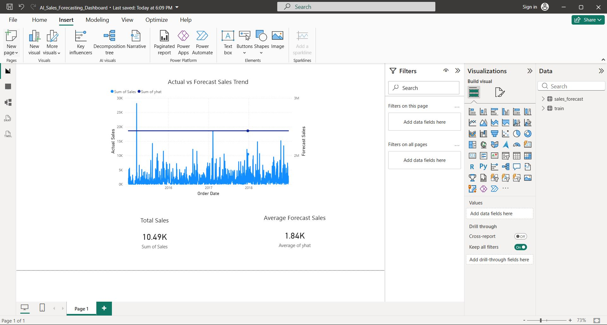

# AI-Powered Sales Forecasting Dashboard

## 📌 Project Overview
This project is part of **Machine Learning Task 1** assigned by **Future Interns**.  
The objective of this task is to build an **AI-powered sales forecasting solution** using historical retail sales data and present insights through an interactive **Power BI dashboard**.

The project combines **data cleaning, time series forecasting, and business visualization** to help retail businesses predict future sales trends.

---

## 🎯 Objectives
- Analyze historical retail sales data
- Forecast future sales using a time series model
- Visualize actual vs forecasted sales
- Provide business-ready insights using Power BI

---

## 🛠️ Tools & Technologies Used
- **Python**
  - Pandas
  - Matplotlib
  - Prophet (for time series forecasting)
- **Jupyter Notebook** – Data analysis & model building
- **Power BI Desktop** – Dashboard creation
- **GitHub** – Project hosting & version control

---

## 📂 Dataset
- **Dataset Name:** Superstore Sales Dataset (Public)
- **File Used:** `train.csv`
- The dataset contains historical order-level retail sales data including dates, regions, categories, and sales values.

---

## 🔄 Project Workflow

### 1️⃣ Data Preprocessing
- Loaded sales data using Pandas
- Converted date columns to proper datetime format
- Aggregated daily sales data
- Removed unnecessary columns

### 2️⃣ Sales Forecasting
- Used **Facebook Prophet** for time series forecasting
- Trained the model on historical daily sales
- Forecasted future sales for upcoming periods
- Generated confidence intervals for predictions

### 3️⃣ Visualization
- Plotted sales trends and forecast results using Matplotlib
- Exported forecast results to CSV for Power BI

### 4️⃣ Power BI Dashboard
The Power BI dashboard includes:
- 📈 **Actual vs Forecast Sales Trend**
- 🔢 **Total Sales KPI**
- 🔢 **Average Forecast Sales KPI**

---

## 📊 Dashboard Preview

---

## 📁 Repository Structure
FUTURE_ML_01/
│
├── sales_forecasting.ipynb # Jupyter Notebook (ML workflow)
├── train.csv # Original dataset
├── sales_forecast.csv # Forecast output from Prophet
├── AI_Sales_Forecasting_Dashboard.pbix # Power BI dashboard file
├── dashboard.png # Dashboard screenshot
└── README.md # Project documentation

---

## 📌 Key Insights
- The forecasting model captures long-term sales trends and seasonality
- Forecasted sales are smoother compared to actual sales due to noise reduction
- The dashboard helps businesses plan inventory, promotions, and demand forecasting

---

## 🚀 Conclusion
This project demonstrates how **Machine Learning and Business Intelligence** can be combined to solve real-world sales forecasting problems.  
It highlights practical skills in **data science, forecasting, and visualization**, aligning with industry expectations.

---

## 🙌 Acknowledgement
This project was completed as part of **Future Interns – Machine Learning Task 1**.

